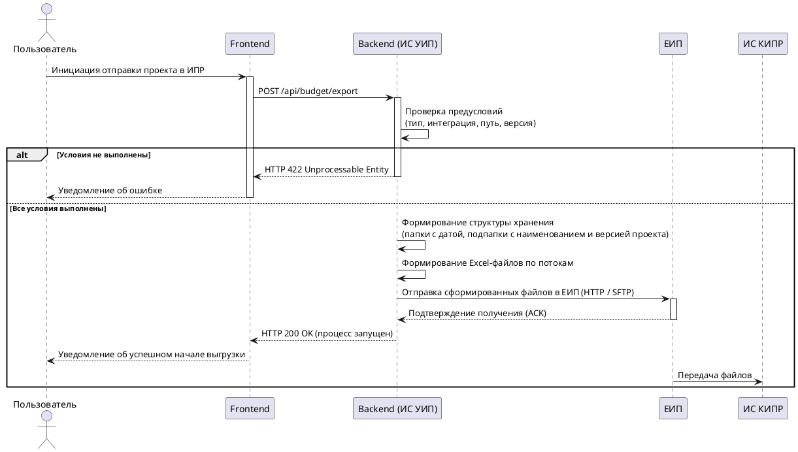

### Диаграмма последовательности отправки проекта

```plantuml
@startuml
actor "Пользователь" as user
participant "Frontend" as front
participant "Backend (ИС УИП)" as uip
participant "ЕИП" as eip
participant "ИС КИПР" as kipr

user->front: Инициация отправки проекта в ИПР
activate front

front->uip: POST /api/budget/export
activate uip

uip->uip: Проверка предусловий \n(тип, интеграция, путь, версия)

alt Условия не выполнены
    uip-->front: HTTP 422 Unprocessable Entity
    deactivate uip

    front-->user: Уведомление об ошибке
    deactivate front

else Все условия выполнены
    uip->uip: Формирование структуры хранения \n(папки с датой, подпапки с наименованием и версией проекта)
    uip->uip: Формирование Excel-файлов по потокам

    uip->eip: Отправка сформированных файлов в ЕИП (HTTP / SFTP)
    activate eip
    eip-->uip: Подтверждение получения (ACK)
    deactivate eip

    uip-->front: HTTP 200 OK (процесс запущен)
    deactivate uip

    front-->user: Уведомление об успешном начале выгрузки
    deactivate front

    ' Асинхронная обработка (black box)
    eip->kipr: Передача файлов
end
@enduml
```